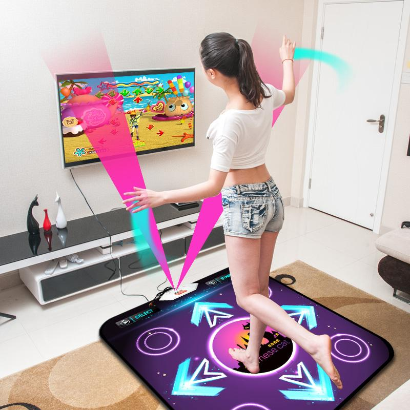

**_ТЕХНОЛОГИЧНО УЧИЛИЩЕ ЕЛЕКТРОННИ СИСТЕМИ към ТЕХНИЧЕСКИ УНИВЕРСИТЕТ - СОФИЯ_**

**_  _**

**_К У Р С О В   П Р О Е К Т _**

**_ _**

**_ _**

*Тема: Проектиране и реализация на платформа за танцуване - **Arduino Dancer*

* *

* ** *

**_Изработили: _***			        ***_Научен ръководител:_**

*Карина Козарова			          инж. Росен Витанов*

*Маргарита Маринова*

**_ _**

**_СОФИЯ _**

**_2018_**

**_Съдържание:_**

1. ЗАДАНИЕ

2. ПРИЛОЖЕНИЕ

3. КОНТРОЛ НА НИВА

4. ПРЕДИМСТВА ПРЕД ПОДОБНИ КОНКУРЕТНИ ПРОДУКТИ

5. ОБЩ ВИД НА ПЛАТФОРМАТА

6. ОБЩА ХАРАКТЕРИСТИКА НА ПРОБЛЕМА 

7. ГЛАВА I. ИЗПОЛЗВАНИ ЧАСТИ

8. ГЛАВА II.  ПРОЕКТИРАНЕ И РЕАЛИЗАЦИЯ НА УСТРОЙСТВОТО 

*  Пълна принципна схема

* Начин на работа на схемата

9. ГЛАВА III. УПРАВЛЯВАЩ СОФТУЕР НА ПЛАТФОРМАТА

* Примерна блок-схема на ниво

* Примерно отчитане кои стрелки са натиснати

* Примерна комуникация с Unity

**ЗАДАНИЕ:**

Платформа, чрез която впоследствие да може да се играе игра, подобна на Just Dance. Проектът включва изработка на платформа с 4 стрелки съответстващи посоките на света (съответно ляво, дясно, напред, назад). 

Софтуерът трябва да разбира коя стрелка е натисната в даден момент, за да може впоследствие да предава тази информация на играта, към която ще се върже платформата.

 Самата игра, която не е част от проекта по КАрх - на екран се показват стрелки. Играчът трябва да настъпи платформата на стрелката, която се е показала на екрана. Ако не я е натиснал достатъчно бързо или е натиснал грешната, на мястото на стрелката се изписва X.

 Комуникацията между играта и Arduino става посредством четене от серийния порт на Ардуино.

**ПРИЛОЖЕНИЕ:**

Чрез използване на платформата като хардуерна основа могат да бъдат реализирани множество игри. Самата платформа може да бъде разглеждана като конзола или контролер в зависимост от играта, която е написана за нея. Като цяло единственото ограничение в приложението на Arduino Dancer е въображението на разработчика на игри за нея. Все пак, платформата е предвидена основно за игри, задвижвани от крака - например Dance Dance Revolution или Just Dance.

 

**КОНТРОЛ НА НИВА:**

Както най-вероятно сте забелязали, проектът ни е само хардуерната платформа. За да има игри за платформата обаче, трябва да намерим лесен начин за свързване на платформата, която ще ползваме като джойстик за различните игри, към лаптоп. 

Ние решихме, че най-лесния начин това да стане е чрез свързване на Серийния монитор на Ардуиното към Unity. Така реално в Unity ще се знае коя стрелка точно на платформата играчът е натиснал и в зависимост от това developer-ите ще могат да отчитат точки или да движат играчи.

**ПРЕДИМСТВА ПРЕД ПОДОБНИ КОНКУРЕТНИ ПРОДУКТИ:**

Основното предимство на нашата платформа е, че кодът е open source следователно всеки един разработчик може да добави нова игра. По този начин се стремим да направим платформата достъпна, защото всички конкуретни продукти са твърде скъпи за средностатистическия човек.

Освен това, поради простотата на самата платформа предлагаме от така наречените DIY(**do-it-yourself**') версии на платформата, с което целим да направим платформата и игрите за нея още по-достъпни. Ако потребителят избере DIY варианта на платформата, ние ще му предоставим частите и единственото, което се изисква от него е да ги сглоби, следвайки инструкции, предоставени от нас.

 Така значително би паднала цената на крайния продукт макар и при този вариант качеството да не е колкото на вече изградена от нас платформа. 

В крайна сметка, нашата платформа има следните предимства:

1. По-евтина от конкурентните предложения

2. Open source

3.  по-голям набор от игри 

4. по-лесно откриване на бъгове 

5.  по-лесно финансиране 

**ОБЩ ВИД НА ПЛАТФОРМАТА:**

**ОБЩА ХАРАКТЕРИСТИКА НА ПРОБЛЕМА **

Повечето подложки за игри, подобни на нашата, имат 2 основни недостатъка - или не са open source(и следователно не всеки може да разработва игри за тях) или хардуерът им е твърде скъп.  За средностатистическия човек, второто е от особена важност. 

Нашата платформа разрешава този проблем комбинирайки метода DIY(do-it-yourself) и всички плюсове на технологиите с отворен лиценз. 

Макар проблема, който разрешаваме, да не е от световно значение, той е важен за нас, защото много хора не могат да си позволят да играят определени игри, защото всяка игра изисква собствена хардуерна платформа понеже повечето производители с цел печалба изработват нова платформа за всяка игра. 

За разлика от тях, ние създаваме 1 платформа, на която могат да се играят множество игри.

**Глава I. Използвани части**

За реализацията на платформата не са използвани сензори.

 	Бутоните са реализирани чрез вградените на Ардуино пиновете PULL-UP резистори, а самата схема е реализирана чрез изполването на микроконтролер Arduino Uno. 

За основа на платформата са използвани дървени плоскости, покрити с фолио. Върху основата са поставени бутони, реализирани отново чрез дървени плоскости, проводници, изолирбанд и алуминиево фолио.

 Бутоните са поставени на разстояние от основата с помощта на гума/пружина, която позволява само при стъпване да се създаде контакт между двете плоскости и така микроконтролерът да разбере, че бутонът е бил натиснат и то точно кой бутон, защото впоследствие при създаване на игри за тази платформа ще бъде  нужно да се знае кой от 4те бутона е бил натиснат.

**Глава II.  Проектиране и реализация на устройството **

**1. Пълна принципна схема **

 На фигурата е показана пълната принципна схема, начертана на KiCad

**2.Начин на работа на схемата**

Схемата показва по какъв начин бутоните на платформата са свързани с Arduino контролера. Всеки бутон е прикачен към пин (pin 8 -> Left, pin 9 -> Right, pin 10 -> Up, pin 11 -> Down) на който се изписва състоянието му. Когато бутонът се натисне на пинът се прочита HIGH, в друг случай състоянието на пинът е LOW.

**Глава III.    Управляващ софтуер на платформата**

1. **Примерна блок-схема на ниво**

**2. Примерно отчитане кои стрелки са натиснати**

2.1. В **_setup_** частта на кода ни: 

2.2 В **_loop_** частта на кода ни:

      Чрез този код на Serial Monitor ще се покаже коя стрелка е натисната. 

      Проблемът при това решение е, че ако задържим върху един бутон, на монитора много пъти ще се изпише посоката без значение, че играчът е стъпил само веднъж. 

      За да решим този проблем, използваме логиката, която се ползва например при клавиатури - не гледаме дали е натиснат бутона, а дали имаме преход от 0 към 1 или обратното.

	Все пак за нашата игра(Arduino Dancer) това не го считаме за проблем, защото точно така искаме да отчитаме, но за други игри може и да се наложи кодът да бъде написан по втория начин.

**3. Примерна комуникация с Unity**

Отваряме стрийма за четене. Важно е да не викаме stream.open() в Update, а в Start! :

Res получава стойност 1,2,3,4 в зависимост от какво е натиснато върху платформата. Имаме 2 начина за взимане на res - чрез ReadChar и чрез ReadByte.

За да получим информацията в такъв формат в Юнити обаче, кодът ни за Ардуино трябва да бъде леко изменен:

